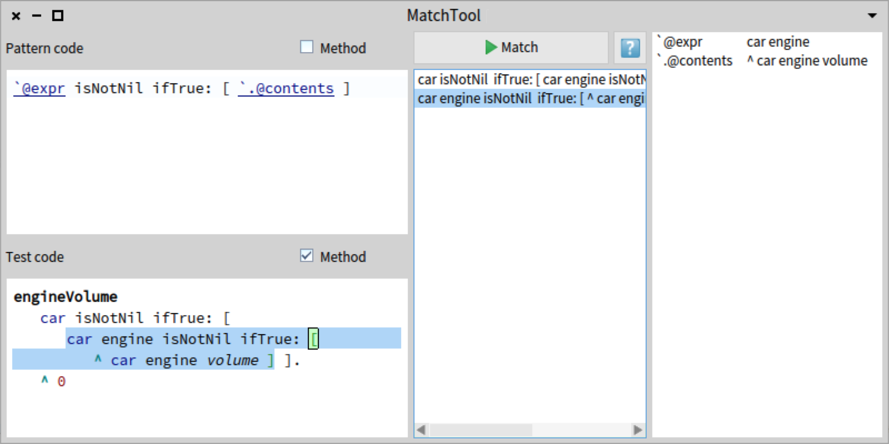

MatchTool 
=========

MatchTool is a simple UI for experimenting with the matching functionality of pattern code.

UI Explanation
--------------

MatchTool can be open from the _World Menu > Tools_ category.

The main window consist of 3 columns. _Fists column_ consists of two code areas. The top one should be used to enter a **match code** also known as pattern code, while the bottom one should be used for entering a plain Smalltalk code as a **test sample**. Both text areas can be switched into a "method mode" when they will parse the entered text as it is method, otherwise they expect the entered code to be an expression. _Second column_ contains **result of matching**, **help button** and the main **execute button** (with a `cmd(ctrl)+enter` shortcut) on top of it. After the button is pressed, both match code and test code are accepted and if there are no errors the matching is performed. MatchTool searches for the match pattern in all the test sample and list the detected matches in the result list. Clicking on the items from the result list highlights the matched interval in the test sample code area and shows the **match map** of the pattern code in the _third column_.

Match map probably needs more explanation. Imagine you have a pattern

    `item printOn: `@expr

While it will match a test sample

    url printOn: FileStream stdout

the match map list will tell you that ``item` was mapped to `url` while ` `@expr` was mapped to `FileStream stdout`.

Installation
------------
Match tool works on Pharo 6 (yes, not even on 5 as 6th already has crucial improvements). It can be installed from the catalog or by running:

    Metacello new
      repository: 'github://Uko/MatchTool';
      baseline: 'MatchTool';
      load
